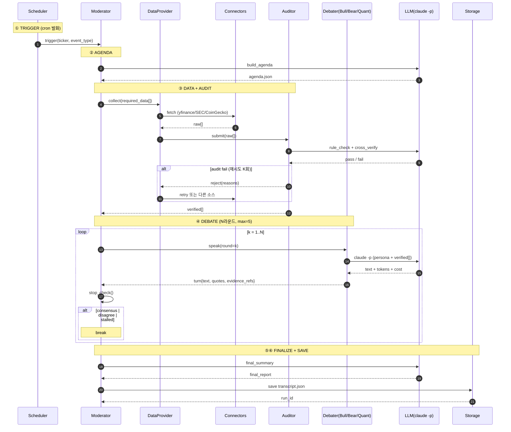
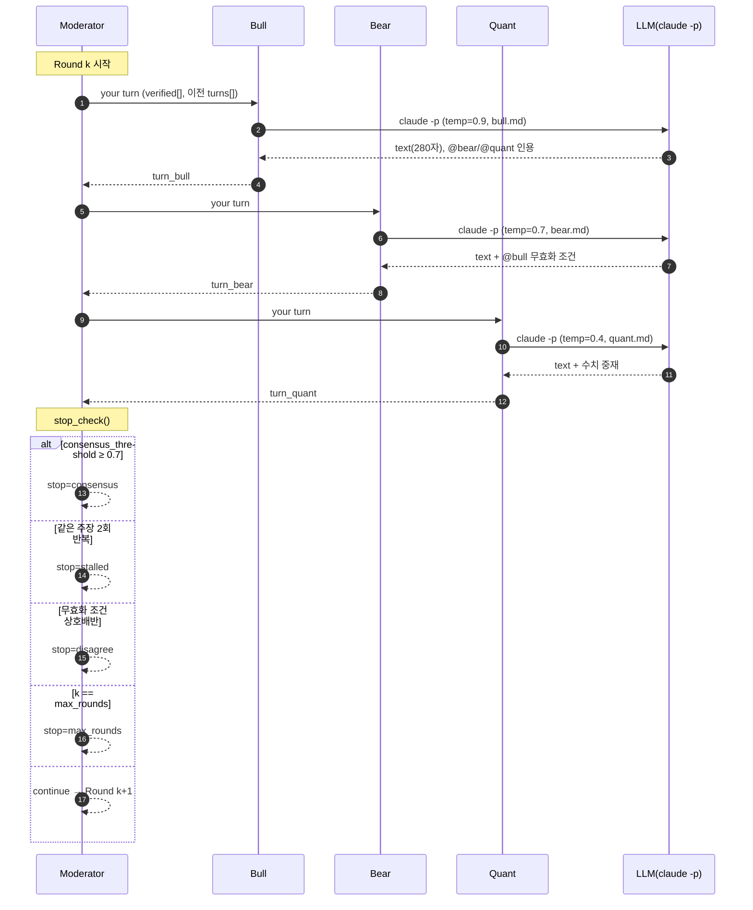
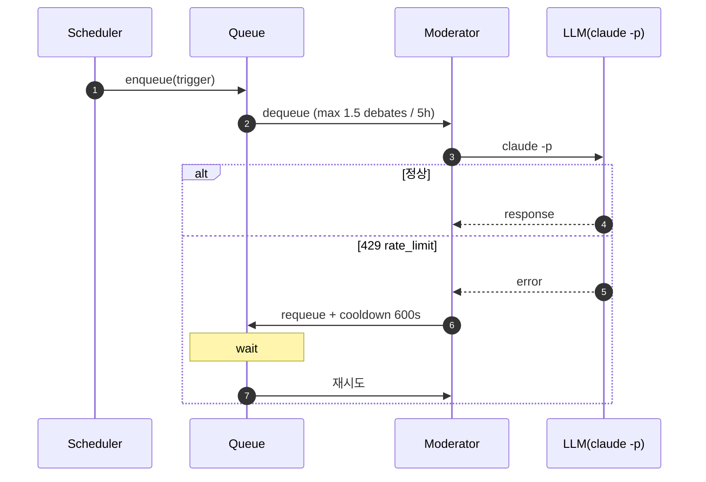

# 아키텍처 — 시퀀스 다이어그램

> mermaid 렌더링 필요: VSCode 확장 "Markdown Preview Mermaid Support" (bierner) 설치

## ① 메인 시퀀스 — 토론 1회 전체

---

## ② 단일 라운드 내부 — 발언·인용·종료 판정

---

## ③ 레이트 리밋 대응 — Claude Max 5h 한도

---

## Actor 그룹 정리

| Actor | 역할 | 파일 |
|---|---|---|
| Scheduler | cron 발화 | `runners/scheduler.py` |
| Moderator | 어젠다·종료 판정·요약 | `agents/moderator.py` |
| DataProvider + Auditor | 외부 수집 + 검수 | `agents/data_provider.py`, `agents/auditor.py` |
| Connectors | 무료 API 호출 | `connectors/*.py` |
| Debater (3) | Bull/Bear/Quant 발언 | `agents/debaters/*.py` |
| LLM | 단일 게이트 (CLI ↔ API swap) | `llm/runner.py` |
| Storage | 트랜스크립트 영속화 | `storage/repository.py` |

---

## 핵심 시퀀스 규칙 3가지

1. **LLM 호출은 모두 `LLM` actor를 통과** → 매수자가 1줄로 swap 가능
2. **Debater는 Connectors에 직접 접근 못 함** → `verified[]` 만 사용 → 환각 차단
3. **Moderator의 `stop_check()`는 LLM 호출 없는 룰 평가** → 종료 판정이 일관됨

→ 이 3개 시퀀스가 곧 매각 데모 시나리오:
- ① "1회 토론이 어떻게 흐르나"
- ② "토론 다양성이 어디서 나오나"
- ③ "비용·운영 안정성이 어떻게 보장되나"
