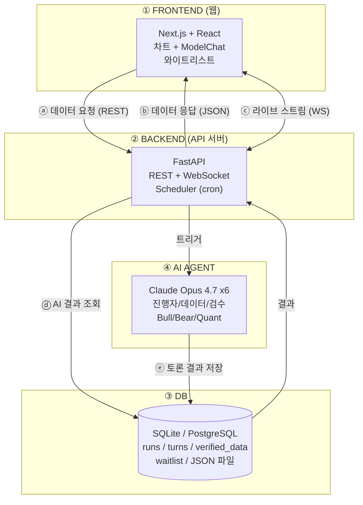

# 시스템 아키텍처 — 4 파트 구조

> PPT 작도용 레퍼런스. 박스·화살표·라벨 그대로 옮겨 그리면 됨.

---

## 전체 구조 (한 장)

```
┌──────────────────────────────┐                ┌──────────────────────────────┐
│  ① FRONTEND (웹)             │                │  ④ AI AGENT                  │
│                              │                │                              │
│  - 좌: 차트 (lightweight-    │                │  - 6 역할 Claude Opus 4.7    │
│    charts / TradingView)     │                │    진행자/데이터/검수/B/B/Q   │
│  - 우: ModelChat 라이브       │                │  - claude CLI subprocess     │
│  - 와이트리스트 캡처          │                │  - 페르소나·룰·파이프라인    │
│  - 한국어 UI (영어 토글)     │                │  - Scheduler (cron 트리거)   │
└─────────────┬────────────────┘                └─────────────┬────────────────┘
              │                                                │
              │ ⓐ 데이터 요청 (REST)                           │ ⓔ 토론 결과 저장
              │ ⓑ 데이터 응답 (JSON)                            │   (트랜스크립트 + 메타)
              │ ⓒ 라이브 스트림 (WebSocket)                     │
              ▼                                                ▼
┌──────────────────────────────┐                ┌──────────────────────────────┐
│  ② BACKEND (API 서버)         │                │  ③ DB                        │
│                              │   ⓓ AI 결과값 조회 (SELECT)    │                              │
│  - FastAPI (Python)          │◀─────────────── │  - SQLite (Phase 1)          │
│  - REST: /debates, /tickers, │                │  - PostgreSQL (Phase 7+)     │
│    /waitlist                 │ ──── 결과 ────▶│  - 테이블:                   │
│  - WebSocket: /ws/modelchat  │                │    runs / turns /            │
│  - 면책 워딩 자동 삽입       │                │    verified_data /           │
│  - 인증 (관리자 only)        │                │    waitlist / tickers        │
│                              │                │  - JSON 파일 (full           │
│                              │                │    transcript) — 매각 자산   │
└──────────────────────────────┘                └──────────────────────────────┘
```

---

## 4 파트 상세

### ① FRONTEND (웹) — 라이브 쇼케이스
| 항목 | 내용 |
|---|---|
| 스택 | Next.js 14 / React 18 / TypeScript / Tailwind |
| 차트 | lightweight-charts (TradingView 오픈소스, 무료) |
| 라이브 | WebSocket — 발언 도착 시 ModelChat 카드 push |
| 페이지 | `/` (라이브), `/runs/<id>` (개별), `/leaderboard`, `/about`, `/waitlist` |
| 배포 | Vercel 무료 티어 또는 Cloudflare Pages |
| 매수자 가치 | Alpha Arena 톤 그대로, 한국어 우선 |

### ② BACKEND (API 서버) — 데이터·트리거 게이트
| 항목 | 내용 |
|---|---|
| 스택 | FastAPI / Python 3.11+ / Uvicorn |
| REST | `GET /debates`, `GET /debates/{id}`, `GET /tickers/{t}/latest`, `POST /waitlist` |
| WebSocket | `/ws/modelchat` — AI Agent 가 발언 publish, 웹이 subscribe |
| 스케줄러 | APScheduler 내장 — config.yml 의 trigger 에 따라 AI Agent 실행 |
| 인증 | JWT (관리자 전용 엔드포인트) |
| 면책 | 모든 응답 텍스트에 "투자자문 아님" 자동 푸터 |

### ③ DB — 매각 자산의 핵심 저장소
| 항목 | 내용 |
|---|---|
| Phase 1 | SQLite (`storage/runs.db`) + JSON 파일 (`storage/runs/*.json`) |
| Phase 7+ | PostgreSQL (운영 안정성) |
| 테이블 | `runs`, `turns`, `verified_data`, `waitlist`, `tickers` |
| 인덱스 | (ticker, started_at), (run_id), (started_at) |
| 백업 | 일간 cron 으로 S3/R2 업로드 (Phase 7) |
| **이중 저장** | SQL = 인덱스용, JSON = 진실의 원본 (트랜스크립트 전체 보존) |

### ④ AI AGENT — 토론 엔진
| 항목 | 내용 |
|---|---|
| LLM | Claude Opus 4.7 (Claude Code CLI 헤드리스) |
| 6 역할 | 진행자 / 데이터제공자 / 검수자 / Bull / Bear / Quant |
| 트리거 | cron (BTC 4h봉, 미장 개시·정오·마감, 매크로) |
| 출력 | 트랜스크립트 JSON → DB + 파일 |
| 추상화 | LLMRunner Protocol — CLI ↔ API swap 1줄 |
| 위치 | 같은 서버 또는 별도 워커 (subprocess 호출이라 분리 권장) |

---

## 데이터 흐름 (5 가지 시나리오)

| # | 라벨 | 흐름 | 설명 |
|---|---|---|---|
| ⓐ | **데이터 요청** | Frontend → Backend | REST GET (종목 리스트, 최근 토론, 트랜스크립트) |
| ⓑ | **데이터 응답** | Backend → Frontend | JSON 응답 (면책 워딩 포함) |
| ⓒ | **라이브 스트림** | Backend ↔ Frontend | WebSocket — 새 발언 발생 시 push |
| ⓓ | **AI 결과 조회** | Backend → DB → Backend | SQL/file read |
| ⓔ | **토론 결과 저장** | AI Agent → DB | 트랜스크립트 + 메타 (run_id, cost, tokens) |

---

## Mermaid 버전 (VSCode 렌더링용)



---

## 배포 토폴로지 (참고 — Phase 7+)

```
┌─────────────────────────────────────────────────────────────┐
│  사용자 브라우저                                            │
└─────────────────────────┬───────────────────────────────────┘
                          ▼
┌─────────────────────────────────────────────────────────────┐
│  Cloudflare / Vercel  (CDN + Next.js 정적 호스팅)           │
└─────────────────────────┬───────────────────────────────────┘
                          ▼  REST/WS
┌─────────────────────────────────────────────────────────────┐
│  Backend 서버 (Fly.io / Railway / 본인 VPS)                  │
│  - FastAPI                                                  │
│  - APScheduler                                              │
└─────────────────────────┬───────────────────────────────────┘
                          │ subprocess
                          ▼
┌─────────────────────────────────────────────────────────────┐
│  AI Agent 워커 (같은 머신)                                  │
│  - claude CLI subprocess (Pro/Max OAuth 인증 사용)          │
└─────────────────────────┬───────────────────────────────────┘
                          ▼
┌─────────────────────────────────────────────────────────────┐
│  DB (SQLite 파일 / Postgres on Supabase)                    │
└─────────────────────────────────────────────────────────────┘
```

---

## 매각 시점의 인계 순서 (5분 절차)

1. **도메인 양도** (Cloudflare/Namecheap 계정 이전)
2. **GitHub 저장소 이전** (코드 + 트랜스크립트 일부 샘플)
3. **DB 덤프 전달** (SQLite 파일 또는 pg_dump)
4. **인증 인계**: 매수자가 자기 머신에서 `claude login` 1회
5. **`config.yml` 확인** → `python -m runners.cli debate --ticker NVDA` 1회 테스트 → 성공이면 완료

→ **`ANTHROPIC_API_KEY` 환경변수가 비어있는지만 확인되면 인계 끝**. 다른 자격증명 양도 불필요.
